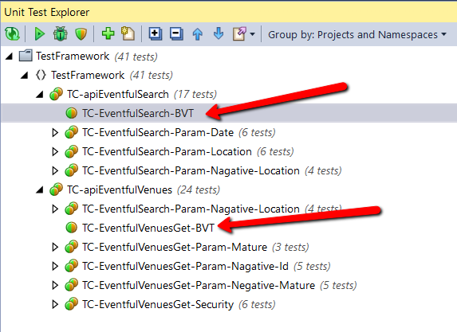
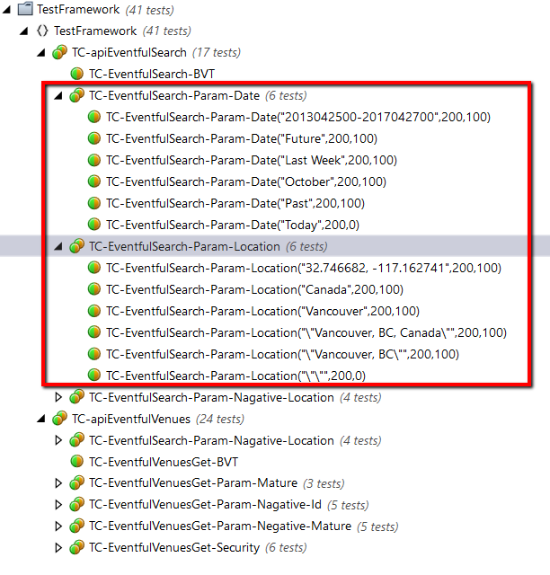
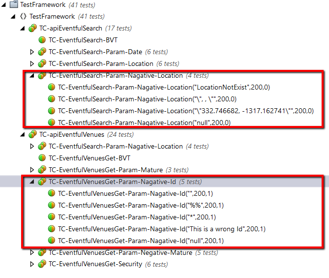
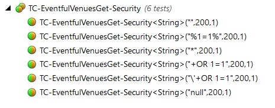

# Api Testing Framework for Eventful
<br />  


## Introduction

In this example, we will use Eventful REST APIs, F# and Nunit to build up a solution how easily we can start Api testing and start to build up test cases. 
<br /> 
 

## Purpose of this example

- Demo the possibility to use F# and Nunit for API testing
- Demo the future possibility to extend the testing framework. 


## Technologies Used

- Visual Studio Community
- .Net 4.6.x or higher
- Nunit v2.6.4 or higher
- FSharp.Data library for Json, XML, CSV, and HTML data access
- Httpfs v.4.1.0 or higher, a http client library
<br />  

## Prerequisites

- Register a user account in Eventful.com 
  - API Key will be obtained from the site. This API Key shall have permission to most of the read APIs
<br />

## Main Features and Functionalities

- Separated Library and Test Cases, easy to re-organize test cases and suties <br />  

<br />  

- Logfile for tracking the test case execution, for tracking activities and timespan<br />  
```C#
addLogEntry ("GET", request.url.ToString(), response.statusCode.ToString(), (System.DateTime.Now.TimeOfDay - startTime).ToString())
```
- Data-driven testing readiness<br /> 
```C#
[<Test>]
[<TestCase("Future", 200, 100)>]
[<TestCase("Past", 200, 100)>]
[<TestCase("2013042500-2017042700", 200, 100)>]
[<TestCase("Today", 200, 0)>]
[<TestCase("Last Week", 200, 100)>]
[<TestCase("October", 200, 100)>]
```


<br />  

## API Test Case Overview
### BVT Test Cases

<br /> 
### Positive Scenario Testing by parameters

<br />  

### Negative Scenario Testing

<br /> 

### Other test cases: Security

<br /> 

### Other test cases: XSS injection or performance testings
<TBD>
<br /> 


## Current difficulties

I was Trying to do a "testing data injection" in "TestFixtureSetUp" section, but realized the "Api_key" is just "read-only". To execute certain Post API calls which allows me to "Write" data, it requires OAuth Token. However, upon the documentation published by Eventful, and tried manually through Fiddler, I coudln't successfully request a token yet. It returns error with either "signature verification failed" or "callback confirmation failed". I added some libraries and functions already for OAuth 1.0 in the project, but need more time to figure it out it authentication details. 
<br /> 


## Conclusion
This is a simple example to show the capability of the test framework to test APIs and keep adding test cases. Even more, considering by using the spreadsheet to load up testing parameters, and/or using saved resultsets to validate the results, the framework could be more efficient and smart. 

